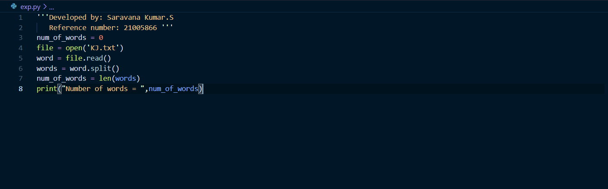
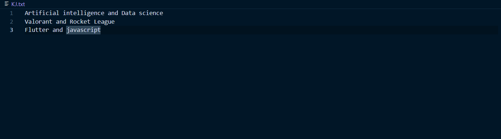
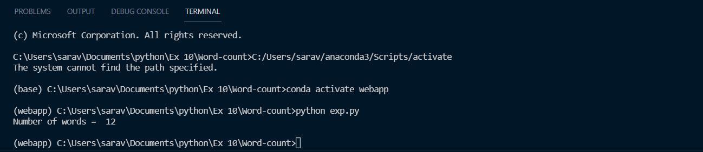

# Word-count
## AIM:
To write a python program for getting the word count from a text.
## EQUIPEMENT'S REQUIRED: 
PC
Anaconda - Python 3.7
## ALGORITHM: 
### Step 1:
Create a text file to count the number of word in that file.
### Step 2:
Open the text file in read mode using open().
### Step 3:
Using split() funtion to split the words in the text file and count it.
### Step 4: 
Save the python program using .py extension.
### Step 5: 
Run the python program in terminal to get the output.
### Step 6:
Number of words in the txt file is displayed as the output.
## PROGRAM:
```
''' Developed by: Saravana Kumar.S
    Reference number: 21005866 '''

num_of_words = 0
file = open('KJ.txt')
word = file.read()
words = word.split()
num_of_words = len(words)
print("Number of words = ",num_of_words)
```
## OUTPUT:
### Program:

### Text File:

### Output:

## Result:
Thus the program is written to find the word count from a text.
